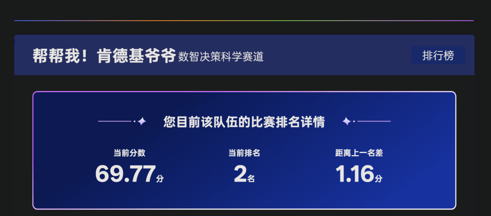

# TGAC 2025 腾讯游戏算法竞赛数智决策科学赛道二等奖方案

[English](README.md) | 中文

## 项目简介

本仓库包含 TGAC 2025 数智决策科学赛道 Text-to-SQL 方案的脱敏实现，面向 Schema 语义稀疏、业务规则隐含和多表关系不明确的 StarRocks 兼容业务数据库。

- 源码: `src/source`
- 架构 PDF: `src/assets/text-to-sql-architecture.pdf`
- 获奖证书: `src/assets/sealdone_3-2.pdf`
- TGAC 官网: https://tgac.tencent.com/

## 获奖信息

- 赛事: Tencent Games Algorithm Competition 2025
- 奖项: 二等奖 / Second Place
- 赛道: Data-Intelligence Decision Science
- 队伍: Help Me! KFC Grandpa
- 成员: [Haizhen Gao](https://github.com/gstranded), Gang Xu, Jiyun Chen
- 证书日期: 2026-01-06

## 全链路流程

1. 融合数据剖析、业务元数据、值域统计和 LLM 描述，构建 Augmented Schema。
2. 通过 MinHash/Jaccard 候选发现与数据库验证挖掘隐式连接键，并构建运行时 Join Graph。
3. 从 Gold SQL 和执行反馈中沉淀 Positive Knowledge、Verification Knowledge 与负向约束。
4. 基于问题、知识和表上下文检索 Few-shot CoT 示例。
5. 使用 Standard、Schema-CoT、Divide-and-Conquer 和 Query Plan 多策略生成 SQL 候选。
6. 在 StarRocks 兼容数据库上执行候选，并根据错误与空结果进行修复。
7. 通过结果一致性、Majority Vote、History Guard 和 LLM Judge 选择最终 SQL。

## 目录结构

- `src/source/pipeline/`: 运行时生成、Join Graph 检索、执行修复、投票与裁决。
- `src/source/knowledge-base/`: Augmented Schema、正向知识、验证约束和 Few-shot CoT 构建。
- `src/assets/`: 架构与获奖材料。

仓库不包含私有赛题数据、数据库凭据、执行日志、模型缓存、生成索引和原始提交结果。
