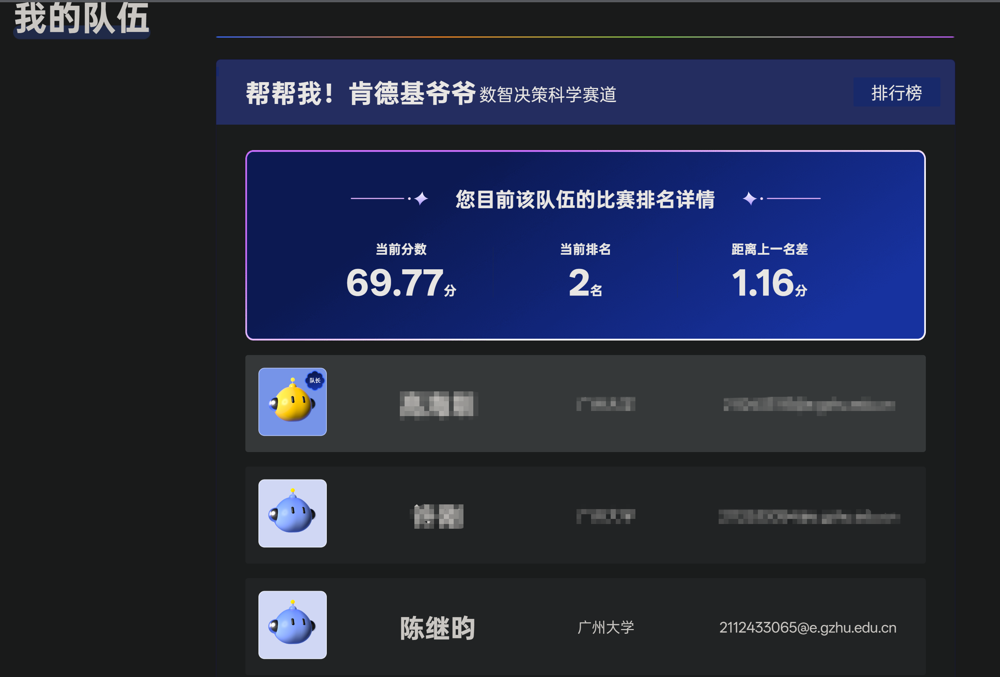

# TGAC 2025 方案复盘与获奖证明

[English](README.md) | 中文



## 项目简介

本仓库发布 TGAC 2025 腾讯游戏算法竞赛「数智决策科学赛道」二等奖的公开证明页面，以及经过脱敏处理的 Text-to-SQL 技术方案复盘。

- 在线页面: https://terra901.github.io/TAGC-Data-Intelligence-Decision-Science/
- GitHub 仓库: https://github.com/terra901/TAGC-Data-Intelligence-Decision-Science
- 证书 PDF: `docs/assets/sealdone_3-2.pdf`
- 架构 PDF: `docs/assets/text-to-sql-architecture.pdf`
- 脱敏源码快照: `docs/source`
- TGAC 官网: https://tgac.tencent.com/

## 获奖信息

- 赛事: Tencent Games Algorithm Competition 2025
- 奖项: 二等奖 / Second Place
- 赛道: Data-Intelligence Decision Science
- 队伍: Help Me! KFC Grandpa
- 成员: [Haizhen Gao](https://github.com/gstranded), Gang Xu, Jiyun Chen
- 证书日期: 2026-01-06

## 方案材料

公开页面包含 Text-to-SQL 方案复盘，重点覆盖:

- Agentic Workflow
- 闭环知识进化
- Augmented Schema
- Positive Knowledge
- Verification Knowledge
- Few-shot CoT
- Execution & Fix
- History Guard
- Majority Vote 与 LLM Judge 仲裁

`docs/source` 目录保留了脱敏后的核心模块结构和构建说明，移除了 API key、私有数据库地址、日志、模型缓存、大型生成产物和原始敏感配置。

## 文件完整性

`docs/assets/sealdone_3-2.pdf` 的 SHA-256:

```text
1FD24D09D2E1D5EBBC887B75B59DCE129F63BE14D276B428C01C011C1189128C
```

Windows PowerShell 本地校验:

```powershell
Get-FileHash docs/assets/sealdone_3-2.pdf -Algorithm SHA256
```

## 本地验证

```bash
node tests/verify-site.mjs
```

期望输出:

```text
Site verification passed.
```

## GitHub Pages 设置

在仓库设置中启用 GitHub Pages:

- Repository: `TAGC-Data-Intelligence-Decision-Science`
- Visibility: Public
- Pages source: Deploy from a branch
- Branch: `main`
- Folder: `/docs`

## 边界说明

本仓库是独立发布的获奖证明与技术复盘，不是腾讯官方页面。
